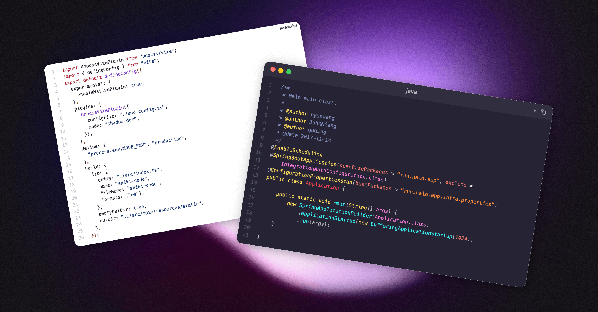

# Shiki 代码高亮

适用于 Halo 的 [Shiki](https://shiki.style/) 代码高亮插件，为文章等内容的代码块提供高亮渲染支持。



## 特性

- 支持 200+ 种编程语言的代码高亮，详见：[Languages | Shiki](https://shiki.style/languages)
- 支持 60 个代码高亮风格，详见：[Themes | Shiki](https://shiki.style/themes)
- 支持两种 UI 风格（简单 / Mac 窗口）
- 无需主题主动适配，在不同主题之间表现一致
- 支持为 Halo 编辑器设置代码块高亮风格
- 支持为非文章页面启用代码高亮渲染，如瞬间、Docsme 文档页面等
- 体积轻量，支持异步加载语言和高亮风格依赖
- 支持分别为暗色和亮色模式设置代码高亮风格
- 支持代码行高亮、行聚焦、代码对比

## 安装

1. 下载，目前提供以下两个下载方式：
    - GitHub Releases：访问 [Releases](https://github.com/halo-sigs/plugin-shiki/releases) 下载 Assets 中的 JAR 文件
    - Halo 应用市场：https://www.halo.run/store/apps/app-kzloktzn
2. 安装，插件安装和更新方式可参考：https://docs.halo.run/user-guide/plugins

## 使用方式

### 个性化设置

安装完成之后，不需要特别的设置即可开始使用，默认会在文章和页面内容自动渲染，以下是一些额外的个性化设置说明：

在阅读下面的内容之前，可以先进入插件设置页面。

1. 基本设置
   1. 启用主题侧渲染： 关闭之后将不会在网站前台执行代码高亮渲染，适用于主题已经提供了代码高亮渲染的场景。
   2. 额外渲染规则：如果你想渲染其他页面中的代码块，可以在这里设置路径规则。
   3. 风格：可选简单和 Mac 窗口，未来会提供更多 UI 风格。
   4. 亮色主题：在主题的亮色模式下的代码高亮风格。
   5. 暗色主题：在主题的暗色模式下的代码高亮风格，非必填，如果不填写则使用亮色主题。
2. 编辑器设置
   1. 高亮主题：为 Halo 编辑器设置代码高亮风格。

### 代码行功能

插件内建了 Shiki 的一些[代码转换器](https://shiki.style/packages/transformers)，包括行高亮、行聚焦、代码对比，以下是具体书写方式：

#### 行高亮

使用 `// [!code highlight]` 或者 `// [!code hl]` 标记即可，示例：

```ts
console.log('Not highlighted')
// [!code highlight]
console.log('Highlighted')
console.log('Not highlighted')
```

也可以用 `// [!code highlight:n]` 批量标记后续 n 行。

此外，有两个额外的变体可以实现不同的背景色：`// [!code warning]`（警告） 和 `// [!code error]` （错误）。

#### 行聚焦

使用 `// [!code focus]` 标记即可，示例：

```ts
console.log('Not focused');
// [!code focus]
console.log('Focused');
console.log('Not focused');
```

```ts
console.log('Not focused');
// [!code focus:2]
console.log('Focused');
console.log('Focused');
```

#### 代码对比

使用 `// [!code --]`（减少行） 和 `// [!code ++]（增加行）` 标记即可，示例：

```ts
// [!code --]
console.log('hewwo')
// [!code ++]
console.log('hello')
console.log('goodbye')
```

```ts
// [!code --]
console.log('hewwo')
// [!code ++:2]
console.log('hello')
console.log('goodbye')
```

## 注意事项

1. [highlight.js 代码高亮](https://github.com/halo-sigs/plugin-highlightjs) 和此插件均为 Halo 官方维护，但目前更加推荐使用此插件，highlight.js 插件将在未来进入维护状态（仅修复问题，不再添加新功能）。
2. 安装此插件之后，建议卸载其他代码高亮插件，以及关闭主题的代码高亮渲染功能（如有）。
3. 与 highlight.js 不同的是，Shiki 不支持将代码块语言设置为 `auto`。在使用此插件时，需要正确设置语言，否则可能无法渲染。
4. 此插件已经尽可能在多个主题中测试兼容性，但无法保证完全兼容，特别是当主题自行实现了代码高亮功能时。如果遇到兼容性问题，建议先尝试关闭主题的代码高亮功能，或者向主题反馈兼容问题。
5. 部分主题使用了 Pjax，经测试在文章页面可以完全兼容。但如果你设置了其他页面的渲染规则，可能在切换页面后代码高亮无法正常渲染，建议考虑关闭 Pjax 功能。
6. 插件支持为主题的暗色和亮色模式设置不同的代码高亮风格，并且尽可能为不同主题的配色切换方案做了适配，但如果你使用的主题不兼容，可能需要向主题反馈兼容问题。

## 主题适配

### 暗色/亮色模式切换

插件支持分别为暗色和亮色模式设置代码高亮风格，但仍然需要主题提供适配，适配方案：

1. 默认情况下，会使用亮色模式渲染代码块。
2. 如果需要在主题的暗黑模式下让代码块使用暗色模式，需要：
   - 在 html / body 标签中添加 `class="dark"` 或者 `class="color-scheme-dark"`
   - 或者在 html / body 标签中添加 `data-color-scheme="dark"`
3. 如果你的主题支持根据操作系统自动切换模式，需要：
   - 在 html / body 标签中添加 `class="color-scheme-auto"`
   - 或者在 html / body 标签中添加 `data-color-scheme="auto"`

如果你的主题已经满足上面的要求，可以不做任何改动。